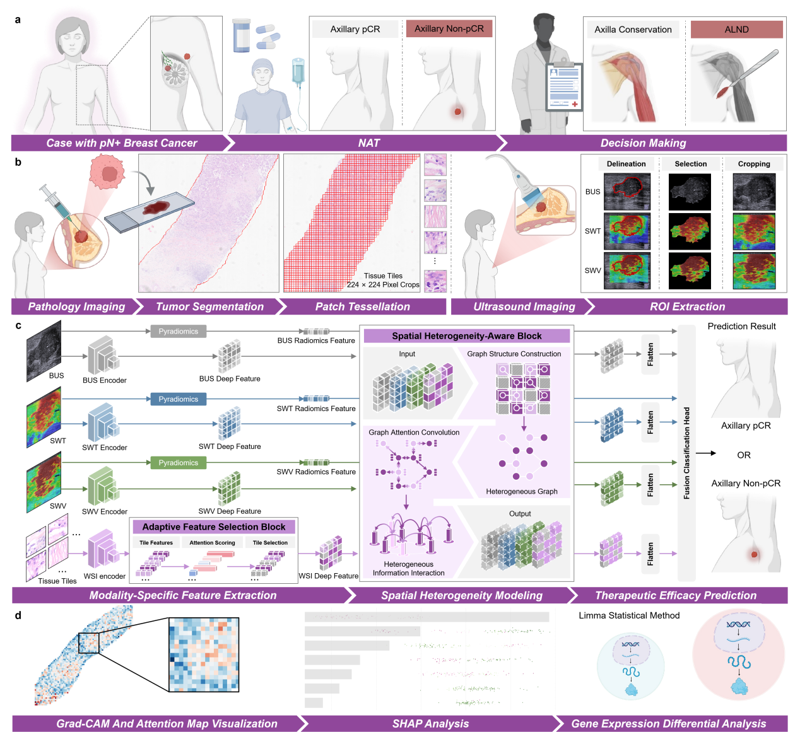
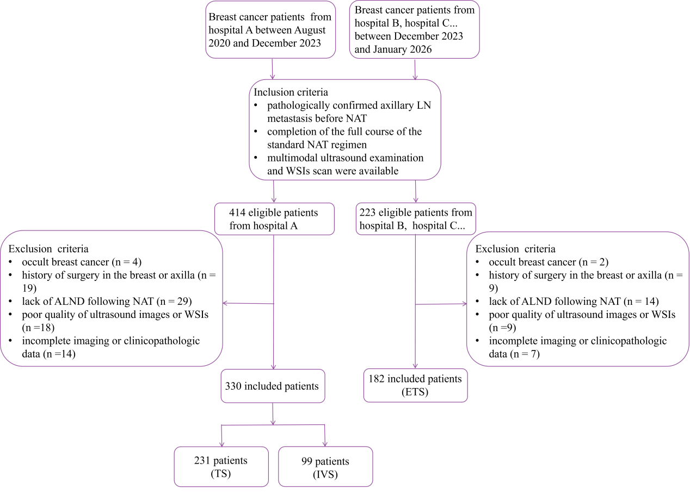
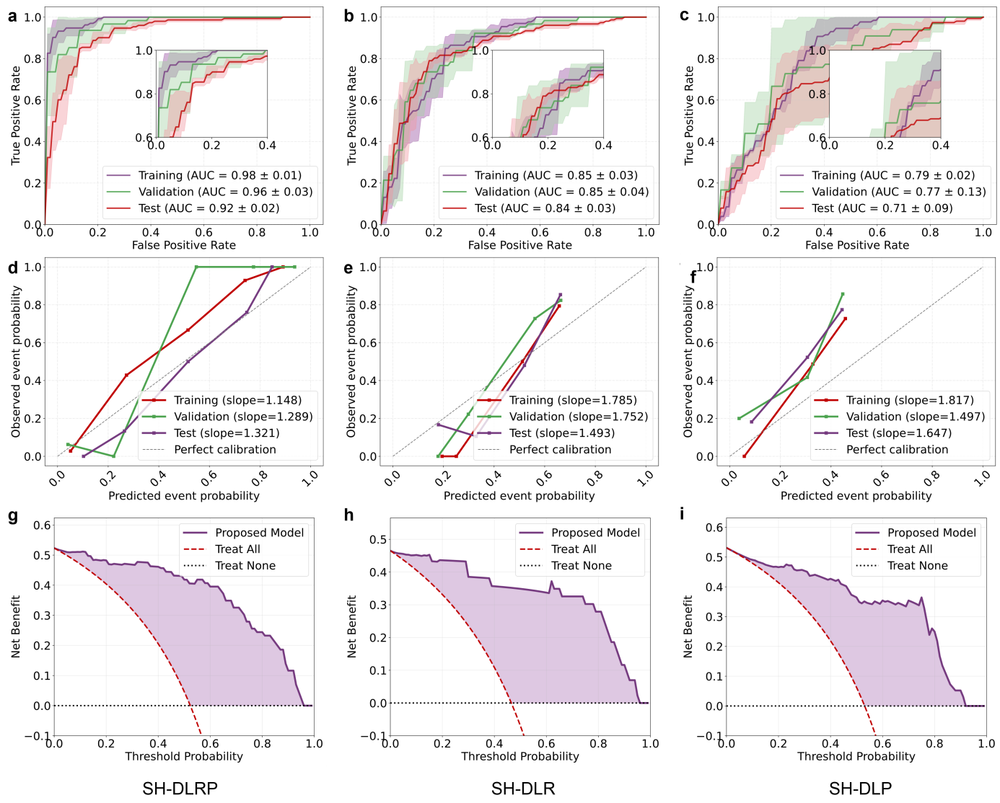
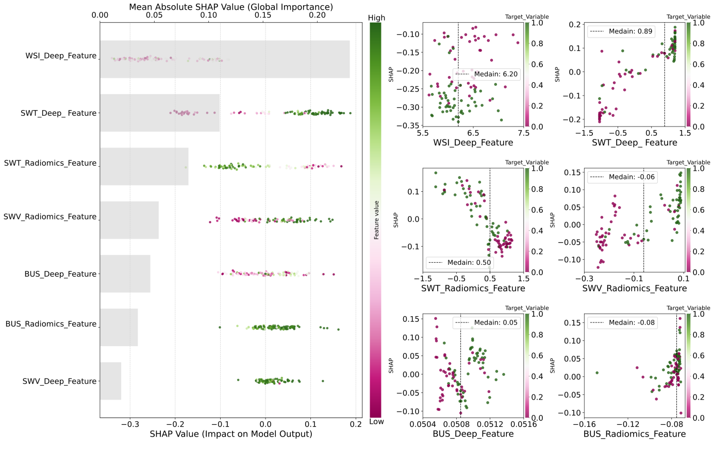
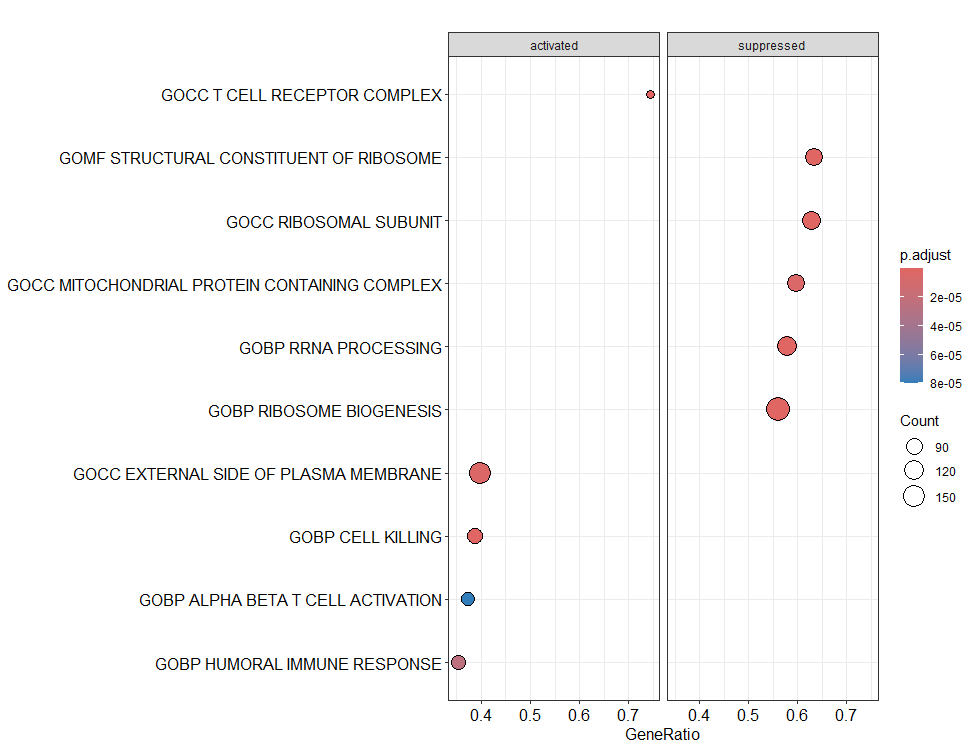
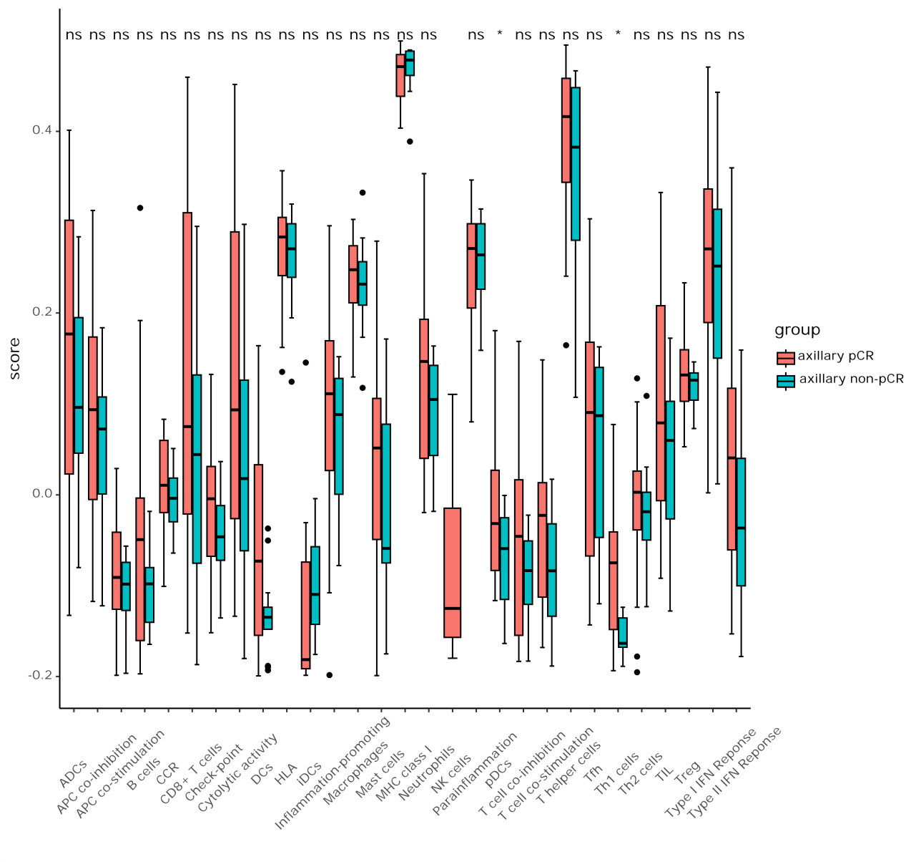

# SH-DLRP

Interpretable deep learning radiopathomics for predicting axillary response to neoadjuvant therapy in node-positive breast cancer.

SH-DLRP integrates multimodal ultrasound, radiomics, and histopathology features to model spatial heterogeneity and predict axillary pathologic complete response (pCR).

## Framework

<p align="center">
  
</p>

The framework contains:

- Modality-specific feature extraction from BUS, SWT, SWV, and WSI.
- Spatial heterogeneity modeling with graph-based feature aggregation.
- Multimodal fusion for axillary response prediction.
- Feature visualization and biological interpretability analysis.

## Results

### Study Population

<p align="center">
  
</p>

### Model Performance

<p align="center">
  
</p>

The SH-DLRP model achieved an AUC of 0.96 on the independent validation set and 0.92 on the external test set, according to the accompanying manuscript.

### Interpretability

<p align="center">
  
</p>

<p align="center">
  
</p>

<p align="center">
  
</p>

## Code Structure

```text
.
├── config.yml
├── train.py
├── test.py
├── ultrasound_preprocess.py
├── wsi_preprocess.py
├── src/
│   ├── dataloader.py
│   ├── models.py
│   ├── extractors.py
│   ├── sh_dlrp/
│   ├── vit/
│   ├── cnn/
│   └── densenet/
├── wsi/
├── utils/
└── assets/figures/
```

## Configuration

The main configuration is stored in `config.yml`.

```yaml
finetune:
  model_choose: sh_dlrp
  extractor_choose: vit

models:
  sh_dlrp:
    modal: us
    top_k: 200
```

Available modalities are `us`, `rad`, `wsi`, and `all`. Use `modal: all` for the complete multimodal ultrasound-radiopathology fusion model.

## Installation

Install a PyTorch version compatible with the local CUDA environment, then install the required Python packages:

```bash
pip install torch torchvision torch-geometric
pip install numpy pandas scipy scikit-learn PyYAML easydict
pip install albumentations opencv-python Pillow timm einops accelerate
pip install tensorboard h5py matplotlib openpyxl lxml tqdm
pip install SimpleITK pyradiomics openslide-python histolab
```

The WSI utilities additionally require the OpenSlide system library.

## Training

After configuring the local environment and pretrained weights:

```bash
python train.py
```

Training results and checkpoints are saved under `logs/` and `model_store/`.

## Notes

- This repository is intended for research use only.
- Patient data and pretrained weights are not included.
- The RNA-seq and immune-infiltration analyses require separate R workflows and input files.
- Radiomics features are used without LASSO-based feature selection.

## Citation

Please cite the associated manuscript when using this code.
